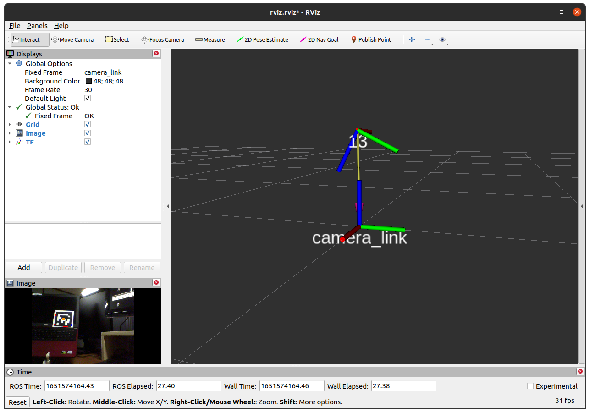

# usbcam_apriltag

You can plug in your any usb cameras to detect apriltag using this package.

Downloading and building the package

```bash
cd ~/catkin_ws/src/
git clone https://github.com/bxtbold/usbcam_apriltag.git
cd ~/catkin_ws && rosdep install --from-paths src --rosdistro <$ROS_DISTRO> -y
catkin build    # or catkin_make
```
Then execute the following to check the result

```bash
roslaunch usbcam_apriltag main.launch
```

This is the test result (Apriltag ID 13 is used in the example)



***

## TODOs

- Camera Calibration

    - add chessboard image to asset
    - rosrun camera_calibration cameracalibrator.py
    - yaml